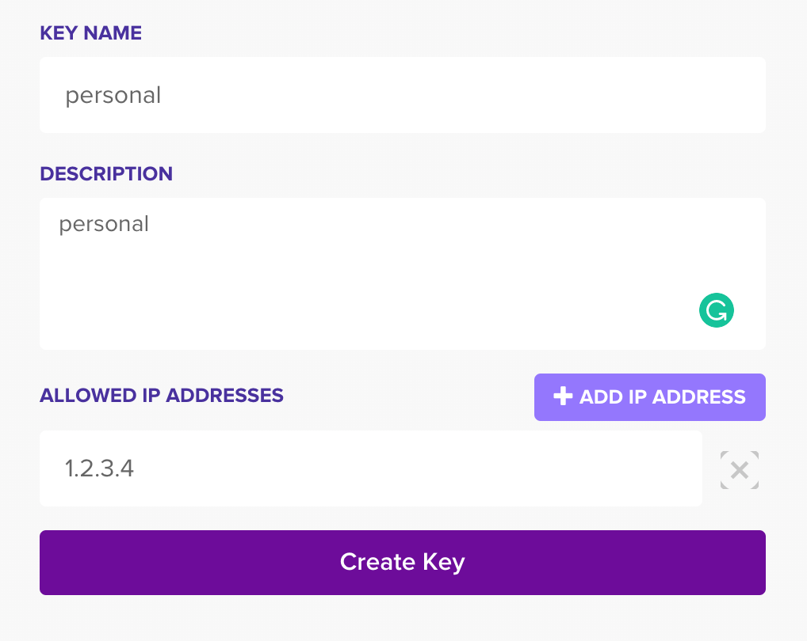
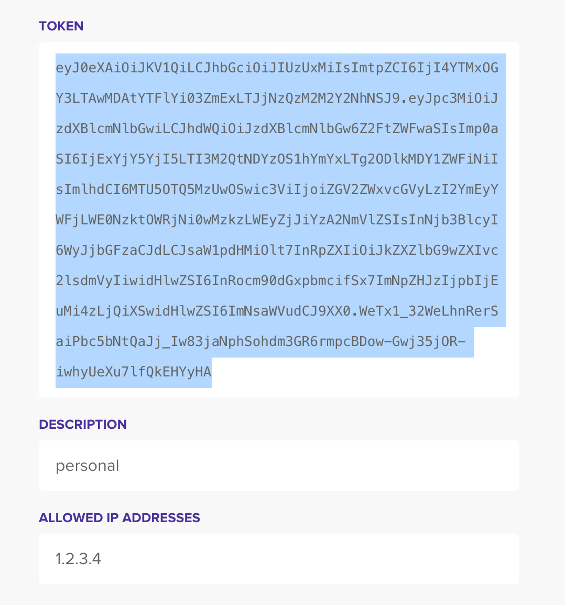

# ts-coc-clanwarleague-stats


[](https://github.com/prettier/prettier)

This generates the stats for Clan War Leagues on Google spreadsheet.

## How to Use

### Initial setup

1. Clone the repository and run npm install
   ```
   $ git clone git@github.com:takkyuuplayer/ts-coc-clanwarleague-stats.git
   $ cd ts-coc-clanwarleague-stats
   $ npm install
   ```
1. Create `credentials.json`
   1. Turn on the Google Sheets API by following [this Step 1](https://developers.google.com/sheets/api/quickstart/nodejs#step_1_turn_on_the). You can use the default for all settings.
   1. Then download `credentials.json` into the cloned directory.
1. Create `cocjwt.txt`
   1. Generate token from [Clash of Clans API](https://developer.clashofclans.com/#/getting-started)
      * Specify your IPv4 address in the ALLOWED IP ADDRESSES when creating the API token
         ```
         $ curl 'https://api.ipify.org'
         1.2.3.4
         ```
         
    2. Save the generated token as `cocjwt.txt`
         
1. Generate `token.json`
   1. Run
      ```
      $ npx ts-node src/main.ts
      ```
      and follow [Step 4's instruction a)-c)](https://developers.google.com/sheets/api/quickstart/nodejs#step_4_run_the_sample).

### Usage

#### Create a new spreadsheet

```
$ npx ts-node src/main.ts "#ClanTag"
```

#### Update an existing spreadsheet

```
$ npx ts-node src/main.ts "#ClanTag" "SpreadsheetId"
```